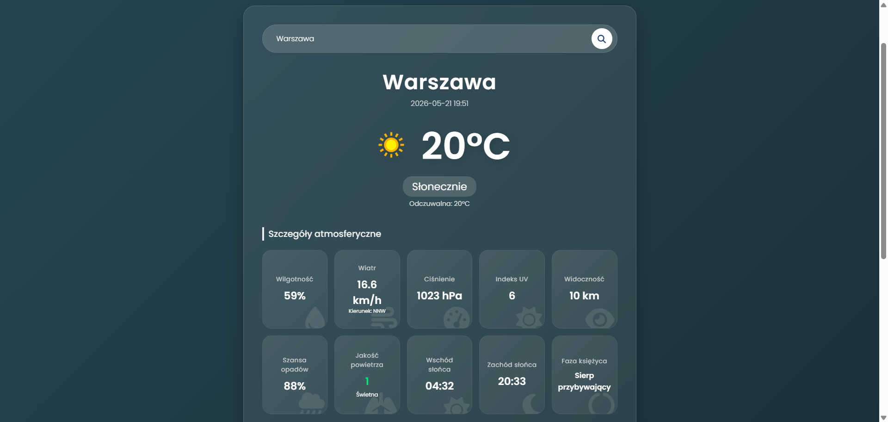

# Web app description:

This basic web app fetches information about current and upcoming weather in your area from a weather API. You can input a city manually or allow GPS access to pinpoint your location. Currently supports polish language only. Hosted on skyglance.pl right now, but that may change.

# User interface:

# Running the project:

http://skyglance.pl
OR install android app
skyglance.apk

